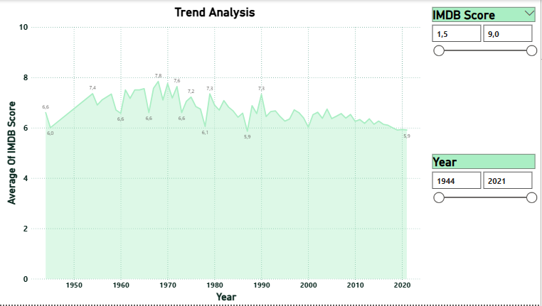

# Netflix IMDb Scores Analysis / Analisi dei punteggi Netflix-IMDb

This project involves data cleaning and Power BI visualizations using Netflix and IMDB Scores datasets. The goal is to analyze Netflix content based on IMDb scores and derive meaningful insights.

Questo progetto prevede la pulizia dei dati e la visualizzazione con Power BI utilizzando i set di dati Netflix e IMDB Scores. L'obiettivo è analizzare i contenuti Netflix sulla base dei punteggi IMDb e ricavarne informazioni significative.

## Data Set / Set di Dati

- **Source:** [Kaggle - Netflix IMDb Scores](https://www.kaggle.com/datasets/thedevastator/netflix-imdb-scores)
- The dataset contains IMDb scores for Netflix content.

- Il set di dati contiene i punteggi IMDb relativi ai contenuti Netflix.

## Data Cleaning / Pulizia dei Dati

Some steps taken during the data cleaning process:

- Identifying missing data and filling/deleting it appropriately
- Adjusting date and number formats
- Standardizing categorical variables
- Converting IMDb scores to numerical data

Alcune operazioni eseguite durante il processo di pulizia dei dati:

- Identificazione dei dati mancanti e loro inserimento/eliminazione appropriata
- Modifica dei formati di data e numero
- Standardizzazione delle variabili categoriali
- Conversione dei punteggi IMDb in dati numerici

## Visualizations (Power BI) / Visualizzazioni (Power BI)

### 1. Film Distribution by Year /  Distribuzione dei Film per Anno

### 2. Percentage Distribution by Year / Distribuzione Percentuale per Anno

### 3. Filterable Movie List /  Elenco Film Filtrabile

### 4. Relation Between IMDb Scores and Votes /  Relazione tra Punteggi IMDb e Eoti

### 5. Trend Analysis / Analisi delle Tendenze

> 📌All visualizations were made on Power BI and the .pbix file was added to the repo.

## Technologies Used / Tecnologie Utilizzate

- Python 
- Pandas, NumPy
- Power BI 

